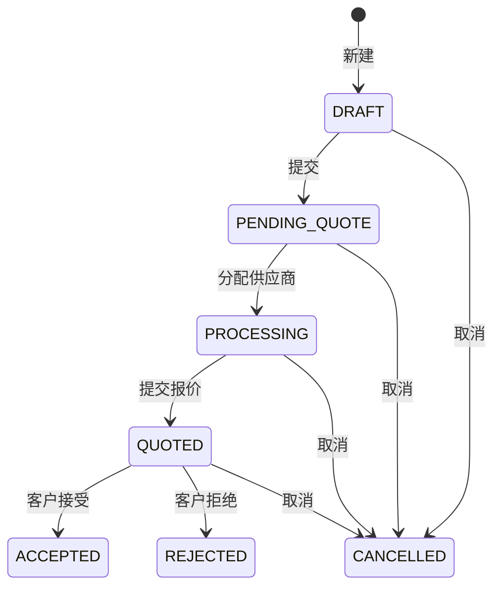
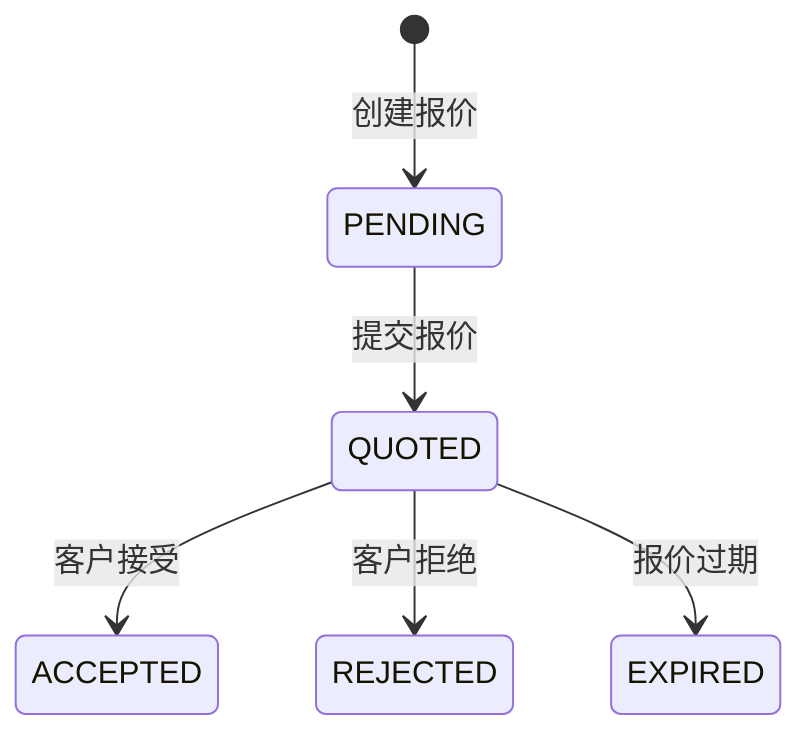

# B2B询报价模块前端开发设计文档

---

## 1. 需求分析

### 1.1 业务背景
B2B询报价模块是企业级采购流程的核心环节，支持采购方向供应商发起询价请求，供应商进行报价响应，最终达成交易。

### 1.2 功能需求

| 模块 | 功能点 | 需求描述 |
|------|--------|----------|
| **询价管理** | 列表展示 | 支持按状态、编号、用户筛选询价单 |
| | 详情查看 | 查看询价单详情、商品明细 |
| | 分配供应商 | 将询价单分配给指定供应商 |
| | 快速报价 | 直接从询价单创建报价 |
| **报价管理** | 列表展示 | 支持按状态、编号、询价单号筛选报价单 |
| | 详情查看 | 查看报价单详情、商品报价明细 |
| | 创建报价 | 根据询价单创建报价单 |
| | 更新报价 | 修改已创建的报价单 |

### 1.3 状态流转

#### 1.3.1 RFQ询价状态流转


#### 1.3.2 报价状态流转


---

## 2. 技术方案

### 2.1 技术栈

| 分类 | 技术 | 版本 |
|------|------|------|
| 框架 | Vue | 3.4+ |
| 构建工具 | Vite | 6.x |
| UI组件 | Ant Design Vue | 4.x |
| 表格组件 | vxe-table | 4.x |
| 状态管理 | Pinia | 2.x |
| 路由 | Vue Router | 4.x |

### 2.2 目录结构

```plaintext
yudao-ui-admin-vben/apps/web-antd/src/views/mall/trade/b2b/
├── rfq/                           # 询价管理模块
│   ├── detail/                    # 详情页
│   │   ├── data.ts                # 详情表单配置
│   │   └── index.vue              # 详情页面
│   ├── modules/                   # 操作表单组件
│   │   ├── assign-form.vue        # 分配供应商表单
│   │   └── quote-form.vue         # 快速报价表单
│   ├── data.ts                    # 列表配置（搜索表单、表格列）
│   └── index.vue                  # 列表页面
├── quotation/                     # 报价管理模块
│   ├── detail/                    # 详情页
│   │   ├── data.ts                # 详情表单配置
│   │   └── index.vue              # 详情页面
│   ├── modules/                   # 操作表单组件
│   │   └── create-form.vue        # 创建报价表单
│   ├── data.ts                    # 列表配置
│   └── index.vue                  # 列表页面
└── components/                    # 公共组件
    ├── rfq-select.vue             # 询价选择器
    └── quotation-select.vue       # 报价选择器
```

### 2.3 文件职责说明

| 文件路径 | 职责说明 | 状态 |
|----------|----------|------|
| `rfq/data.ts` | 询价列表搜索表单、表格列配置、状态映射 | 待开发 |
| `rfq/index.vue` | 询价列表主页面 | 待优化 |
| `rfq/detail/data.ts` | 询价详情描述表单配置 | 待开发 |
| `rfq/detail/index.vue` | 询价详情主页面 | 待优化 |
| `rfq/modules/assign-form.vue` | 分配供应商弹窗表单 | 待优化 |
| `rfq/modules/quote-form.vue` | 快速报价弹窗表单 | 待开发 |
| `quotation/data.ts` | 报价列表搜索表单、表格列配置 | 待优化 |
| `quotation/index.vue` | 报价列表主页面 | 待优化 |
| `quotation/detail/data.ts` | 报价详情描述表单配置 | 待开发 |
| `quotation/detail/index.vue` | 报价详情主页面 | 待开发 |
| `quotation/modules/create-form.vue` | 创建报价弹窗表单 | 待开发 |

---

## 3. 接口设计

### 3.1 询价管理API

| API路径 | HTTP方法 | 功能描述 |
|---------|----------|----------|
| `/trade/b2b/rfq/page` | GET | 分页查询询价列表 |
| `/trade/b2b/rfq/{id}` | GET | 查询询价详情 |
| `/trade/b2b/rfq` | POST | 创建询价单 |
| `/trade/b2b/rfq/{id}` | PUT | 更新询价单 |
| `/trade/b2b/rfq/{id}` | DELETE | 删除询价单 |
| `/trade/b2b/rfq/{id}/submit` | POST | 提交询价单 |
| `/trade/b2b/rfq/{id}/assign-supplier` | PUT | 分配供应商 |
| `/trade/b2b/rfq/{id}/cancel` | POST | 取消询价单 |

### 3.2 报价管理API

| API路径 | HTTP方法 | 功能描述 |
|---------|----------|----------|
| `/trade/b2b/quotation/page` | GET | 分页查询报价列表 |
| `/trade/b2b/quotation/{id}` | GET | 查询报价详情 |
| `/trade/b2b/quotation` | POST | 创建报价单 |
| `/trade/b2b/quotation/{id}` | PUT | 更新报价单 |
| `/trade/b2b/quotation/{id}` | DELETE | 删除报价单 |
| `/trade/b2b/quotation/{id}/submit` | POST | 提交报价 |
| `/trade/b2b/quotation/{id}/accept` | POST | 接受报价 |
| `/trade/b2b/quotation/{id}/reject` | POST | 拒绝报价 |

### 3.3 API类型定义

```typescript
// 询价单分页项
interface RfqPageItem {
  id: number;
  no: string;
  status: number;
  supplierId?: number;
  supplierName?: string;
  itemCount: number;
  submittedAt?: string;
  createdAt: string;
  items: RfqItem[];
}

// 询价商品项
interface RfqItem {
  id: number;
  productId: number;
  productName: string;
  skuId?: number;
  skuName?: string;
  imageUrl?: string;
  count: number;
  expectedPrice?: string;
  specifications?: string;
  unit?: string;
  brand?: string;
}

// 报价单分页项
interface QuotationPageItem {
  id: number;
  no: string;
  rfqId: number;
  rfqNo: string;
  supplierId: number;
  supplierName: string;
  status: number;
  totalPrice: string;
  currency: string;
  incoterms?: string;
  validUntil?: string;
  createdAt: string;
  items: QuotationItem[];
}

// 报价商品项
interface QuotationItem {
  id: number;
  productId: number;
  productName: string;
  skuId?: number;
  skuName?: string;
  imageUrl?: string;
  count: number;
  unitPrice: string;
  subtotalPrice: string;
}
```

---

## 4. 页面设计

### 4.1 询价列表页 (`rfq/index.vue`)

#### 4.1.1 搜索表单

| 字段名 | 标签 | 组件类型 | 数据源 |
|--------|------|----------|--------|
| `status` | 状态 | Select | 字典 TRADE_B2B_RFQ_STATUS |
| `no` | 询价单号 | Input | - |
| `userId` | 用户ID | Input | - |
| `supplierId` | 供应商ID | Input | - |
| `createTime` | 创建时间 | RangePicker | - |

#### 4.1.2 表格列

| 字段名 | 表头 | 宽度 | 渲染方式 |
|--------|------|------|----------|
| - | 展开 | 80 | expand插槽 |
| `no` | 询价单号 | 180 | 文本 |
| `status` | 状态 | 100 | CellDict |
| `supplierName` | 供应商 | 120 | 文本 |
| `itemCount` | 商品数量 | 80 | 数字 |
| `submittedAt` | 提交时间 | 160 | 日期格式化 |
| `createdAt` | 创建时间 | 160 | 日期格式化 |
| - | 操作 | 180 | actions插槽 |

#### 4.1.3 操作按钮

| 按钮 | 权限 | 显示条件 |
|------|------|----------|
| 详情 | `trade:b2b:rfq:detail` | 始终显示 |
| 分配供应商 | `trade:b2b:rfq:assign-supplier` | 状态为待报价/处理中 |
| 快速报价 | `trade:b2b:quotation:create` | 状态为处理中 |

### 4.2 询价详情页 (`rfq/detail/index.vue`)

#### 4.2.1 详情区域

| 区域 | 字段 | 说明 |
|------|------|------|
| 基本信息 | 询价单号、状态、创建时间、提交时间 | 3列布局 |
| 供应商信息 | 供应商ID、供应商名称 | 2列布局 |
| 商品明细 | 商品列表表格 | 展开行形式 |

#### 4.2.2 操作按钮

| 按钮 | 权限 | 显示条件 |
|------|------|----------|
| 返回列表 | - | 始终显示 |
| 分配供应商 | `trade:b2b:rfq:assign-supplier` | 状态为待报价 |
| 创建报价 | `trade:b2b:quotation:create` | 已分配供应商 |
| 添加备注 | `trade:b2b:rfq:remark` | 始终显示 |

### 4.3 报价列表页 (`quotation/index.vue`)

#### 4.3.1 搜索表单

| 字段名 | 标签 | 组件类型 | 数据源 |
|--------|------|----------|--------|
| `status` | 状态 | Select | 字典 TRADE_B2B_QUOTATION_STATUS |
| `no` | 报价单号 | Input | - |
| `rfqNo` | 询价单号 | Input | - |
| `supplierId` | 供应商ID | Input | - |
| `createTime` | 创建时间 | RangePicker | - |

#### 4.3.2 表格列

| 字段名 | 表头 | 宽度 | 渲染方式 |
|--------|------|------|----------|
| - | 展开 | 80 | expand插槽 |
| `no` | 报价单号 | 180 | 文本 |
| `rfqNo` | 询价单号 | 180 | 文本 |
| `supplierName` | 供应商 | 120 | 文本 |
| `status` | 状态 | 100 | CellDict |
| `totalPrice` | 总金额 | 120 | 金额格式化 |
| `currency` | 货币 | 80 | 文本 |
| `incoterms` | 贸易条款 | 120 | 文本 |
| `createdAt` | 创建时间 | 160 | 日期格式化 |
| - | 操作 | 180 | actions插槽 |

#### 4.3.3 操作按钮

| 按钮 | 权限 | 显示条件 |
|------|------|----------|
| 详情 | `trade:b2b:quotation:detail` | 始终显示 |
| 编辑报价 | `trade:b2b:quotation:update` | 状态为待报价 |
| 接受报价 | `trade:b2b:quotation:accept` | 状态为已报价 |
| 拒绝报价 | `trade:b2b:quotation:reject` | 状态为已报价 |

### 4.4 报价详情页 (`quotation/detail/index.vue`)

#### 4.4.1 详情区域

| 区域 | 字段 | 说明 |
|------|------|------|
| 基本信息 | 报价单号、询价单号、状态、创建时间 | 3列布局 |
| 供应商信息 | 供应商ID、供应商名称 | 2列布局 |
| 报价信息 | 总金额、货币、贸易条款、有效期 | 4列布局 |
| 商品明细 | 商品报价列表表格 | 展开行形式 |

#### 4.4.2 操作按钮

| 按钮 | 权限 | 显示条件 |
|------|------|----------|
| 返回列表 | - | 始终显示 |
| 编辑报价 | `trade:b2b:quotation:update` | 状态为待报价 |
| 接受报价 | `trade:b2b:quotation:accept` | 状态为已报价 |
| 拒绝报价 | `trade:b2b:quotation:reject` | 状态为已报价 |

---

## 5. 组件设计

### 5.1 分配供应商表单 (`rfq/modules/assign-form.vue`)

| 字段名 | 标签 | 组件类型 | 必填 |
|--------|------|----------|------|
| `supplierId` | 供应商ID | Input | 是 |
| `supplierName` | 供应商名称 | Input | 是 |

### 5.2 快速报价表单 (`rfq/modules/quote-form.vue`)

| 字段名 | 标签 | 组件类型 | 必填 |
|--------|------|----------|------|
| `currency` | 货币 | Select | 是 |
| `incoterms` | 贸易条款 | Select | 否 |
| `deliveryType` | 配送方式 | Select | 否 |
| `validUntil` | 有效期 | DatePicker | 否 |
| `remark` | 备注 | TextArea | 否 |
| `items[].unitPrice` | 单价 | InputNumber | 是 |

### 5.3 创建报价表单 (`quotation/modules/create-form.vue`)

| 字段名 | 标签 | 组件类型 | 必填 |
|--------|------|----------|------|
| `rfqId` | 关联询价ID | Hidden | 是 |
| `supplierId` | 供应商ID | Input | 是 |
| `currency` | 货币 | Select | 是 |
| `incoterms` | 贸易条款 | Select | 否 |
| `deliveryType` | 配送方式 | Select | 否 |
| `validUntil` | 有效期 | DatePicker | 否 |
| `remark` | 备注 | TextArea | 否 |

---

## 6. 数据字典

### 6.1 询价状态 (`TRADE_B2B_RFQ_STATUS`)

| 编码 | 名称 | 说明 |
|------|------|------|
| 0 | 草稿 | 询价单创建后未提交 |
| 10 | 待报价 | 询价单已提交，等待分配供应商 |
| 15 | 处理中 | 已分配供应商，正在报价 |
| 20 | 已报价 | 供应商已提交报价 |
| 30 | 已接受 | 客户已接受报价 |
| 40 | 已拒绝 | 客户已拒绝报价 |
| 50 | 已取消 | 询价单已取消 |

### 6.2 报价状态 (`TRADE_B2B_QUOTATION_STATUS`)

| 编码 | 名称 | 说明 |
|------|------|------|
| 0 | 待报价 | 报价单创建后未提交 |
| 10 | 已报价 | 报价单已提交 |
| 20 | 已接受 | 客户已接受报价 |
| 30 | 已拒绝 | 客户已拒绝报价 |
| 40 | 已过期 | 报价已过期 |

### 6.3 贸易条款 (`TRADE_B2B_INCOTERMS`)

| 编码 | 名称 | 说明 |
|------|------|------|
| EXW | EXW | 工厂交货 |
| FOB | FOB | 离岸价 |
| CIF | CIF | 到岸价 |
| DDP | DDP | 完税后交货 |

---

## 7. 权限配置

| 权限编码 | 权限名称 | 所属模块 |
|----------|----------|----------|
| `trade:b2b:rfq:query` | 查询询价单 | RFQ询价 |
| `trade:b2b:rfq:detail` | 查看询价详情 | RFQ询价 |
| `trade:b2b:rfq:create` | 创建询价单 | RFQ询价 |
| `trade:b2b:rfq:update` | 更新询价单 | RFQ询价 |
| `trade:b2b:rfq:delete` | 删除询价单 | RFQ询价 |
| `trade:b2b:rfq:assign-supplier` | 分配供应商 | RFQ询价 |
| `trade:b2b:rfq:remark` | 添加备注 | RFQ询价 |
| `trade:b2b:quotation:query` | 查询报价单 | Quotation报价 |
| `trade:b2b:quotation:detail` | 查看报价详情 | Quotation报价 |
| `trade:b2b:quotation:create` | 创建报价单 | Quotation报价 |
| `trade:b2b:quotation:update` | 更新报价单 | Quotation报价 |
| `trade:b2b:quotation:delete` | 删除报价单 | Quotation报价 |
| `trade:b2b:quotation:accept` | 接受报价 | Quotation报价 |
| `trade:b2b:quotation:reject` | 拒绝报价 | Quotation报价 |

---

## 8. 开发计划

### 8.1 任务分解

| 序号 | 任务名称 | 预估工时 | 优先级 | 依赖任务 |
|------|----------|----------|--------|----------|
| 1 | 完善询价列表数据配置 | 4h | 高 | - |
| 2 | 优化询价列表页面 | 6h | 高 | 1 |
| 3 | 完善询价详情数据配置 | 4h | 高 | - |
| 4 | 优化询价详情页面 | 8h | 高 | 3 |
| 5 | 开发快速报价表单 | 8h | 高 | 1, 2 |
| 6 | 完善报价列表数据配置 | 4h | 高 | - |
| 7 | 优化报价列表页面 | 6h | 高 | 6 |
| 8 | 开发报价详情数据配置 | 4h | 高 | - |
| 9 | 开发报价详情页面 | 8h | 高 | 8 |
| 10 | 开发创建报价表单 | 8h | 高 | 6 |
| 11 | 开发公共组件 | 6h | 中 | - |
| 12 | 联调测试 | 8h | 高 | 1-10 |

### 8.2 里程碑

| 阶段 | 时间 | 交付物 |
|------|------|--------|
| 第一阶段 | 第1-2天 | 询价列表、详情页优化完成 |
| 第二阶段 | 第3-4天 | 报价列表、详情页开发完成 |
| 第三阶段 | 第5-6天 | 操作表单开发完成 |
| 第四阶段 | 第7-8天 | 联调测试完成 |

---

## 9. 代码规范

### 9.1 命名规范

| 类型 | 规则 | 示例 |
|------|------|------|
| 文件 | 小写+中划线 | `assign-form.vue` |
| 函数 | 驼峰式 | `useGridFormSchema()` |
| 组件 | PascalCase | `RfqDetail` |
| 变量 | 驼峰式 | `rfqDetail` |
| 常量 | 大写+下划线 | `RFQ_STATUS_MAP` |

### 9.2 代码风格

1. **响应式数据**：使用 `ref`/`reactive`，避免直接修改props
2. **表单配置**：统一使用 `VbenFormSchema` 格式
3. **表格配置**：统一使用 `useVbenVxeGrid` 组合式函数
4. **国际化**：所有文案使用 `$t()` 包裹
5. **权限控制**：使用 `auth` 属性控制按钮显示
6. **类型定义**：使用 TypeScript 类型定义，避免 `any`

### 9.3 注释规范

1. **文件头部**：添加文件说明注释
2. **函数方法**：添加 JSDoc 注释
3. **复杂逻辑**：添加行内注释
4. **状态映射**：添加状态说明

---

## 10. 附录

### 10.1 状态码对照表

| 模块 | 状态码 | 状态名称 |
|------|--------|----------|
| RFQ | 0 | 草稿 |
| RFQ | 10 | 待报价 |
| RFQ | 15 | 处理中 |
| RFQ | 20 | 已报价 |
| RFQ | 30 | 已接受 |
| RFQ | 40 | 已拒绝 |
| RFQ | 50 | 已取消 |
| Quotation | 0 | 待报价 |
| Quotation | 10 | 已报价 |
| Quotation | 20 | 已接受 |
| Quotation | 30 | 已拒绝 |
| Quotation | 40 | 已过期 |

### 10.2 货币类型

| 编码 | 名称 |
|------|------|
| CNY | 人民币 |
| USD | 美元 |
| EUR | 欧元 |

---

**文档版本**: v1.0  
**创建日期**: 2026-06-13  
**作者**: Frontend Team  
**审核**: TBD
