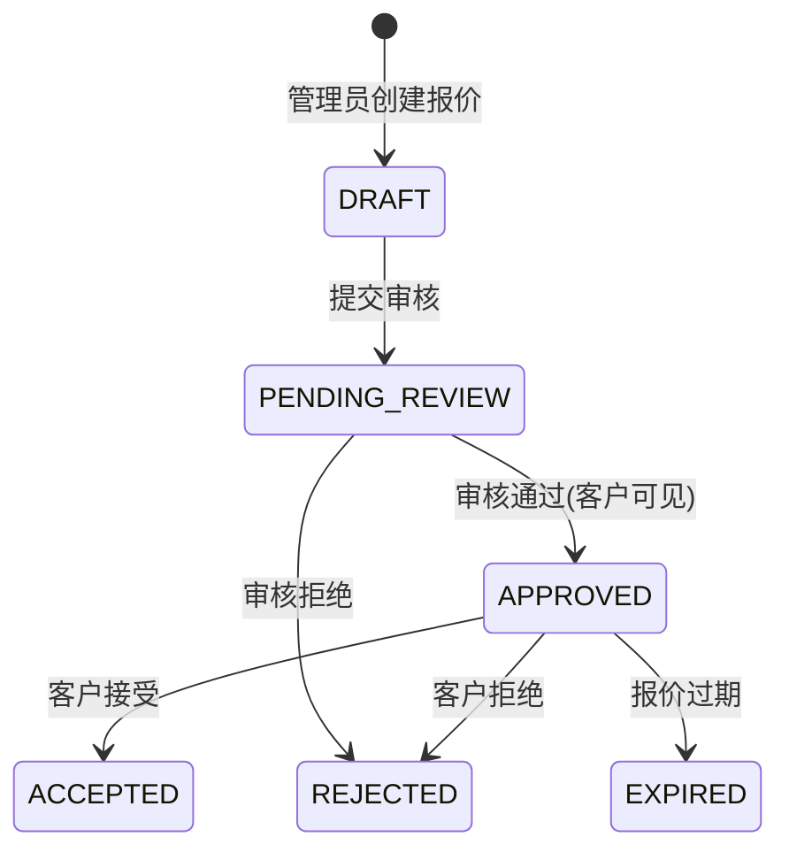

# B2B询报价模块前端开发设计文档

---

## 0. 版本历史

| 版本 | 日期 | 变更内容 | 作者 |
|------|------|----------|------|
| v1.0 | 2026-06-13 | 初始版本，基础询报价功能 | Frontend Team |
| v2.0 | 2026-06-19 | 重大升级：增加审核流程、比价功能、供应商信息脱敏 | Frontend Team |

---

## 📦 附件：各页面组件复用规划（附使用示例）

### 询价列表页 - 可复用组件清单

| 组件 | 来源 | 用途 | 使用示例位置 |
|------|------|------|------------|
| ✅ `Page` | `@vben/common-ui` | 页面容器，自动高度 | `rfq/index.vue` |
| ✅ `useVbenVxeGrid` | `#/adapter/vxe-table` | 表格主组件 | `rfq/index.vue` |
| ✅ `TableAction` | `#/adapter/vxe-table` | 操作按钮组 | `rfq/index.vue` |
| ✅ `ACTION_ICON` | `#/adapter/vxe-table` | 操作图标常量 | `rfq/index.vue` |
| ✅ `CellDict` | `#/adapter/vxe-table` | 状态列字典渲染 | `rfq/data.ts columns` |
| ✅ `useVbenModal` | `@vben/common-ui` | 分配供应商弹窗 | `rfq/modules/assign-form.vue` |
| ✅ `Image` | `ant-design-vue` | 展开行商品图片 | `rfq/index.vue expand` |
| ✅ `Tag` | `ant-design-vue` | 商品规格标签 | `rfq/index.vue expand` |

**📝 参考实现样例**（参考 `trade/afterSale/index.vue` 风格）：
```vue
<template>
  <Page auto-content-height>
    <Grid>
      <template #expand_content="{ row }">
        <!-- 商品展开行 -->
      </template>
      <template #actions="{ row }">
        <TableAction :actions="[]" :drop-down-actions="[]" />
      </template>
    </Grid>
  </Page>
</template>
```

---

### 询价详情页 - 可复用组件清单

| 组件 | 来源 | 用途 | 使用示例位置 |
|------|------|------|------------|
| ✅ `Page` | `@vben/common-ui` | 页面容器 | `rfq/detail/index.vue` |
| ✅ `Tabs` | `ant-design-vue` | 4个 Tab 切换 | `rfq/detail/index.vue` |
| ✅ `useDescription` | `#/components/description` | 基本信息描述卡片 | Tab 1 |
| ✅ `useVbenVxeGrid` | `#/adapter/vxe-table` | 报价列表表格 | Tab 2 |
| ✅ `DictTag` | `#/components/dict-tag` | 报价状态标签 | Tab 2 表格 |
| ✅ `Button` | `ant-design-vue` | 操作按钮（去比价等） | 顶部操作栏 |
| ✅ `Image` | `ant-design-vue` | 商品图片 | 多个 Tab |
| ✅ `Tag` | `ant-design-vue` | 规格标签 | 商品列表 |

**📝 参考实现样例**（Tab 布局参考 `order/detail/index.vue`）：
```vue
<template>
  <Page auto-content-height>
    <div class="flex gap-4">
      <Button type="primary">去比价</Button>
    </div>
    <Tabs v-model:activeKey="activeTab">
      <Tabs.TabPane key="basic" tab="基本信息">
        <BasicInfoDescriptions />
      </Tabs.TabPane>
      <Tabs.TabPane key="quotations" tab="报价列表">
        <QuotationGrid />
      </Tabs.TabPane>
      <Tabs.TabPane key="compare" tab="比价结果">
        <CompareResult />
      </Tabs.TabPane>
    </Tabs>
  </Page>
</template>
```

---

### 报价列表页 - 可复用组件清单

| 组件 | 来源 | 用途 | 使用示例位置 |
|------|------|------|------------|
| ✅ `Page` | `@vben/common-ui` | 页面容器 | `quotation/index.vue` |
| ✅ `useVbenVxeGrid` | `#/adapter/vxe-table` | 报价表格 | `quotation/index.vue` |
| ✅ `TableAction` | `#/adapter/vxe-table` | 操作按钮组 | `quotation/index.vue` |
| ✅ `CellDict` | `#/adapter/vxe-table` | 状态列渲染 | `quotation/data.ts` |
| ✅ `DocAlert` | `@vben/common-ui` | 顶部文档提示（可选） | `quotation/index.vue` |
| ✅ `Image` | `ant-design-vue` | 展开行商品图片 | 展开插槽 |

---

### 报价编辑页（独立页面）- 可复用组件清单

| 组件 | 来源 | 用途 | 使用示例位置 |
|------|------|------|------------|
| ✅ `Page` | `@vben/common-ui` | 页面容器 | `quotation/form/index.vue` |
| ✅ `FormCreate` | `#/components/form-create` | 动态表单生成 | 基本信息表单 |
| ✅ `useVbenVxeGrid` | `#/adapter/vxe-table` | 商品报价编辑表格 | 商品明细区 |
| ✅ `Select` | `ant-design-vue` | 供应商下拉选择 | 基本信息区 |
| ✅ `InputNumber` | `ant-design-vue` | 单价/数量输入 | 商品表格 |
| ✅ `Button` | `ant-design-vue` | 保存/提交按钮 | 底部操作栏 |
| ✅ `Card` | `ant-design-vue` | 信息区域分组 | 页面布局 |

**📝 供应商下拉选择参考代码**：
```typescript
// form/data.ts - 表单 schema 配置
{
  fieldName: 'supplierId',
  label: $t('trade.b2b.quotation.form.supplier'),
  component: 'Select',
  componentProps: {
    // 调用供应商列表接口（仅返回启用状态的）
    api: '/product/supplier/list-all-simple',
    labelField: 'name',
    valueField: 'id',
  },
  rules: 'required',
}
```

---

### 比价工作台 - 可复用组件清单

| 组件 | 来源 | 用途 | 使用示例位置 |
|------|------|------|------------|
| ✅ `Page` | `@vben/common-ui` | 页面容器 | `compare/index.vue` |
| ✅ `Card` | `ant-design-vue` | 比价信息概览卡片 | 顶部概览 |
| ✅ `Button` | `ant-design-vue` | 工具栏操作按钮 | 顶部工具栏 |
| ✅ `Tag` | `ant-design-vue` | 最低价标记、已选标记 | 比价表格 |
| ✅ `Radio.Group` | `ant-design-vue` | 每行供应商选择 | 比价表格操作列 |
| ✅ `Image` | `ant-design-vue` | 商品图片 | 表格商品列 |
| ✅ `StatisticCard` | `@vben/common-ui` | 比价统计汇总卡片 | 底部汇总区 |

**📝 比价表格核心实现思路**：
```vue
<template>
  <a-table :columns="dynamicColumns" :data-source="skuItems">
    <template #bodyCell="{ column, record }">
      <!-- 商品列固定渲染 -->
      <template v-if="column.key === 'product'">
        <Image :src="record.picUrl" />
        <span>{{ record.spuName }}</span>
      </template>
      
      <!-- 供应商报价列动态渲染 -->
      <template v-else-if="column.key.startsWith('q_')">
        <div v-if="record.quotationPrices.get(column.quotationId)">
          <span class="font-bold">
            ¥{{ record.quotationPrices.get(column.quotationId).unitPrice }}
          </span>
          <!-- 最低价标红
### 1.1 业务背景
B2B询报价模块是企业级采购流程的核心环节，支持**管理员线下与供应商沟通后录入报价**，经审核后客户可见，最终支持多供应商比价并达成交易。

### 1.2 核心设计原则
1. **非平台模式**：系统内不直接对接供应商，由管理员线下沟通后录入
2. **报价审核制**：所有报价需审核通过后客户才能看到
3. **🔒 供应商信息完全脱敏**：客户端全程看不到任何供应商相关信息
   - ❌ 供应商ID、名称、联系方式完全隐藏
   - ❌ 不能通过商品来源反向推断供应商
   - ✅ 比价选择后，客户看到的是"混合供应商报价单"（来源统一显示为系统）
4. **多供应商比价**：支持按商品维度选择最优供应商报价

### 1.3 功能需求（v2.0）

| 模块 | 功能点 | 需求描述 |
|------|--------|----------|
| **询价管理** | 列表展示 | 支持按状态、编号、用户筛选询价单 |
| | 详情查看 | Tab 模式：基本信息/报价列表/比价结果/操作日志 |
| | 分配供应商 | 将询价单分配给指定供应商 |
| | 报价数统计 | 显示"已审核数/总报价数" |
| **报价管理** | 列表展示 | 支持按状态、询价单号筛选 |
| | 详情查看 | 查看报价单详情、商品报价明细 |
| | 创建报价（草稿） | 根据询价单创建报价单 |
| | 更新报价 | 仅草稿状态可修改 |
| | 提交审核 | 草稿→待审核 |
| | 审核通过/拒绝 | 待审核→已审核/已拒绝 |
| **比价功能** ⭐新增 | 横向比价表 | 商品为行，供应商为列，横向比价 |
| | 按商品选择 | 每个商品单独选择供应商报价 |
| | 最低价自动标记 | 自动识别并标红最低价 |
| | 全选最低价 | 一键全选各商品最低价 |
| | 比价选择保存/确认 | 保存草稿，确认后客户可见 |
| **客户端可见性** | 状态过滤 | 仅已审核、已接受、已过期状态可见 |
| | 供应商脱敏 | 客户端看不到供应商ID/名称 |

---

## 2. 状态机设计（v2.0 重大变更）

### 2.1 RFQ询价状态流转


### 2.2 报价状态流转（v2.0 审核流程


### 2.3 客户可见性规则
- ✅ **APPROVED（已审核）：客户可见
- ✅ **ACCEPTED（已接受）：客户可见
- ✅ **EXPIRED（已过期）**：客户可见
- ❌ **DRAFT（草稿）**：客户不可见
- ❌ **PENDING_REVIEW（待审核）**：客户不可见
- ❌ **REJECTED（已拒绝）**：客户不可见

---

## 3. 技术方案

### 3.1 技术栈

| 分类 | 技术 | 版本 |
|------|------|------|
| 框架 | Vue | 3.4+ |
| 构建工具 | Vite | 6.x |
| UI组件 | Ant Design Vue | 4.x |
| 表格组件 | vxe-table | 4.x |
| 状态管理 | Pinia | 2.x |
| 路由 | Vue Router | 4.x |

### 3. 供应商管理集成设计（✅ 后端已实现）

### 3.1 供应商选择功能

**供应商列表页（复用现有模块）
- 供应商CRUD：`/product/supplier/page`
- 供应商下拉选择：`/product/supplier/list-all-simple`
- 供应商-商品关联：`/product/supplier/spu/list-by-supplier`

### 3.2 报价单中的供应商集成点

| 场景 | 说明 |
|------|------|
| 创建报价 | 下拉选择供应商（`list-all-simple`） |
| 比价表格列头 | 显示 supplierName |
| 报价详情页 | 显示供应商信息 |
| 比价选择汇总 | 显示各商品对应供应商 |

---

## 4. 项目代码规范（来自项目配置文件提取）

#### 4.1 国际化规范（强制执行）
```typescript
// 1. 所有可见文本使用 $t()，禁止硬编码中文
const title = $t('trade.b2b.rfq.index.title');

// 2. Key 命名规范：模块名.分组名.键名
//    zh-CN/trade.json
{
  "b2b": {
    "rfq": {
      "index": { "title": "询价单列表" }
    }
  }
}

// 3. 参数化使用 {0}, {1}，参数也需国际化
const msg = $t('ui.actionMessage.deleteSuccess', [$t('common.user')]);
```

#### 4.2 VxeTable 使用规范
```typescript
// ✅ 正确：从适配器导入
import type { VxeTableGridOptions } from '#/adapter/vxe-table';

// ✅ 正确：使用 CellDict 字典渲染
cellRender: { name: 'CellDict', props: { type: DICT_TYPE.TRADE_B2B_RFQ_STATUS } }

// ❌ 禁止：从 vxe-table 直接导入
// import type { VxeGridPropTypes } from 'vxe-table';

// ❌ 禁止：在 cellRender.props 中使用函数
```

#### 4.3 现有页面设计模式（统一遵循）

**模式 1：列表页标准结构**（参考 `order/index.vue` 风格）
```
┌─────────────────────────────────────────────┐
│ Page 容器                                    │
│ ┌─────────────────────────────────────────┐ │
│ │ VbenVxeGrid                            │ │
│ │ ┌─────────────────────────────────────┐ │ │
│ │ │ 顶部工具栏（刷新、搜索、新增按钮）   │ │ │
│ │ ├─────────────────────────────────────┤ │ │
│ │ │ 搜索表单区域                        │ │ │
│ │ ├─────────────────────────────────────┤ │ │
│ │ │ 表格主体（可展开、固定列、操作列）  │ │ │
│ │ └─────────────────────────────────────┘ │ │
│ └─────────────────────────────────────────┘ │
└─────────────────────────────────────────────┘
```

**模式 2：详情页标准结构**（参考 `order/detail/index.vue` 风格）
- 使用 `useDescription()` 创建描述卡片
- Tab 切换不同内容区块

**模式 3：弹窗表单标准结构**
```typescript
const [Modal, modalApi] = useVbenModal({
  connectedComponent: FormComponent,
  destroyOnClose: true,
});
// @success="gridApi.query()"
```

### 5.1 目录结构（v2.0）

```plaintext
yudao-ui-admin-vben/apps/web-antd/src/views/mall/trade/b2b/
├── rfq/                           # 询价管理模块
│   ├── detail/                    # 详情页（Tab 模式）
│   │   ├── data.ts                # 详情表单配置
│   │   └── index.vue              # 详情页面（报价列表/比价结果/日志）
│   ├── modules/                   # 操作表单组件
│   │   ├── assign-form.vue        # 分配供应商表单
│   │   └── quote-form.vue         # 删除，改为独立页面
│   ├── data.ts                    # 列表配置
│   └── index.vue                  # 列表页面
├── quotation/                     # 报价管理模块
│   ├── form/                      # 新增：编辑页
│   │   ├── index.vue              # 报价单编辑表单
│   │   └── data.ts               # 表单 Schema
│   ├── detail/                    # 详情页
│   │   ├── data.ts                # 详情表单配置
│   │   └── index.vue              # 详情页面
│   ├── modules/                   # 操作表单组件
│   │   ├── approve-form.vue        # 新增：审核通过弹窗
│   │   └── reject-form.vue         # 新增：审核拒绝弹窗
│   ├── data.ts                    # 列表配置
│   └── index.vue                  # 列表页面
└── compare/                         # 新增：比价工作台模块
    ├── index.vue                    # 比价主页面
    ├── data.ts                      # 表格 Schema
    └── components/
        ├── compare-grid.vue         # 横向比价表格核心
        ├── selection-summary.vue    # 选择汇总卡片
        └── supplier-header.vue      # 供应商列头组件
```

### 5.2 文件职责说明

| 文件路径 | 职责说明 | 状态 |
|----------|----------|------|
| `rfq/data.ts` | 询价列表搜索表单、表格列配置、报价数字段 | 待优化 |
| `rfq/index.vue` | 询价列表主页面，增加比价入口按钮 | 待优化 |
| `rfq/detail/data.ts` | 询价详情 Tab 页配置 | 重写 |
| `rfq/detail/index.vue` | 询价详情主页面（Tab 模式） | 重写 |
| `rfq/modules/assign-form.vue` | 分配供应商弹窗表单 | 待优化 |
| `quotation/data.ts` | 报价列表搜索表单、表格列配置 | 待优化 |
| `quotation/index.vue` | 报价列表主页面，增加审核操作 | 待优化 |
| `quotation/form/data.ts` | 报价编辑表单配置（商品可编辑表格） | 新增 |
| `quotation/form/index.vue` | 报价编辑独立页面 | 新增 |
| `quotation/detail/data.ts` | 报价详情描述表单配置 | 待开发 |
| `quotation/detail/index.vue` | 报价详情主页面，增加审核操作按钮 | 待开发 |
| `quotation/modules/approve-form.vue` | 审核通过弹窗表单 | 新增 |
| `quotation/modules/reject-form.vue` | 审核拒绝弹窗表单 | 新增 |
| `compare/index.vue` | 比价工作台主页面 | 新增 |
| `compare/data.ts` | 比价表格列配置 | 新增 |
| `compare/components/compare-grid.vue` | 横向比价表格组件（动态列、Radio 选择） | 新增 |
| `compare/components/selection-summary.vue` | 比价选择结果汇总卡片 | 新增 |

---

## 4. 接口设计

### 4.1 询价管理API

| API路径 | HTTP方法 | 功能描述 |
|---------|----------|----------|
| `/trade/b2b/rfq/page` | GET | 分页查询询价列表 |
| `/trade/b2b/rfq/{id}` | GET | 查询询价详情 |
| `/trade/b2b/rfq` | POST | 创建询价单 |
| `/trade/b2b/rfq/{id}` | PUT | 更新询价单 |
| `/trade/b2b/rfq/{id}` | DELETE | 删除询价单 |
| `/trade/b2b/rfq/{id}/submit` | POST | 提交询价单 |
| `/trade/b2b/rfq/{id}/assign-supplier` | PUT | 分配供应商 |
| `/trade/b2b/rfq/{id}/cancel` | POST | 取消询价单 |

### 4.2 报价管理API（v2.0 审核相关）

| API路径 | HTTP方法 | 功能描述 |
|---------|----------|----------|
| `/trade/b2b/quotation/page` | GET | 分页查询报价列表 |
| `/trade/b2b/quotation/{id}` | GET | 查询报价详情 |
| `/trade/b2b/quotation` | POST | 创建报价单（草稿状态） |
| `/trade/b2b/quotation/{id}` | PUT | 更新报价单（仅草稿） |
| `/trade/b2b/quotation/{id}/submit-review` | POST | 提交审核（草稿→待审核） |
| `/trade/b2b/quotation/{id}/approve` | POST | 审核通过（待审核→已审核） |
| `/trade/b2b/quotation/{id}/reject` | POST | 审核拒绝（待审核→已拒绝） |
| `/trade/b2b/quotation/{id}/accept` | POST | 接受报价（客户端） |
| `/trade/b2b/quotation/{id}/reject` | POST | 拒绝报价（客户端） |

### 4.3 比价功能API（v2.0 新增）

| API路径 | HTTP方法 | 功能描述 |
|---------|----------|----------|
| `/trade/b2b/quotation/compare?rfqId={id}` | GET | 获取比价视图数据 |
| `/trade/b2b/quotation/save-selection` | POST | 保存比价选择（草稿） |
| `/trade/b2b/quotation/confirm-selection` | POST | 确认比价选择（客户可见） |
| `/trade/b2b/quotation/get-selection?rfqId={id}` | GET | 获取已保存的比价选择 |

---

## 5. 页面详细设计

### 5.1 询价列表页 (`rfq/index.vue`)

#### 5.1.1 搜索表单

| 字段名 | 标签 | 组件类型 | 数据源 |
|--------|------|----------|--------|
| `status` | 状态 | Select | 字典 TRADE_B2B_RFQ_STATUS |
| `no` | 询价单号 | Input | - |
| `userId` | 用户ID | Input | - |
| `supplierId` | 供应商ID | Input | - |
| `createTime` | 创建时间 | RangePicker | - |

#### 5.1.2 表格列

| 字段名 | 表头 | 宽度 | 渲染方式 |
|--------|------|------|----------|
| - | 展开 | 80 | expand插槽 |
| `no` | 询价单号 | 180 | 文本 |
| `status` | 状态 | 100 | CellDict |
| `supplierName` | 供应商 | 120 | 文本 |
| `itemCount` | 商品数量 | 80 | 数字 |
| `quotationCount` | 报价数 | 100 | "已审核数/总数"格式 |
| `submittedAt` | 提交时间 | 160 | 日期格式化 |
| `createdAt` | 创建时间 | 160 | 日期格式化 |
| - | 操作 | 200 | actions插槽 |

#### 5.1.3 操作按钮

| 按钮 | 权限 | 显示条件 |
|------|------|----------|
| 详情 | `trade:b2b:rfq:detail` | 始终显示 |
| 分配供应商 | `trade:b2b:rfq:assign-supplier` | 状态为待报价/处理中 |
| 去报价 | `trade:b2b:quotation:create` | 状态为处理中 |
| ⭐去比价 | `trade:b2b:quotation:compare` | 有已审核报价时 |

### 5.2 询价详情页 (`rfq/detail/index.vue`) - Tab 模式

#### 5.2.1 顶部操作栏

| 按钮 | 权限 | 显示条件 |
|------|------|----------|
| 返回列表 | - | 始终显示 |
| 分配供应商 | `trade:b2b:rfq:assign-supplier` | 状态为待报价 |
| 创建报价 | `trade:b2b:quotation:create` | 状态为处理中 |
| 去比价 | `trade:b2b:quotation:compare` | 有已审核报价 |

#### 5.2.2 Tab 内容区域

| Tab 标签 | 内容说明 |
|-----------|----------|
| 基本信息 | 询价单号、状态、商品明细（useDescription + 表格） |
| 报价列表 | 该询价下所有报价单表格（状态、供应商、总金额等） |
| 比价结果 | 横向比价表 + 已选择汇总 |
| 操作日志 | 状态变更历史记录（useVxeGrid） |

### 5.3 报价列表页 (`quotation/index.vue`)

#### 5.3.1 搜索表单

| 字段名 | 标签 | 组件类型 | 数据源 |
|--------|------|----------|--------|
| `status` | 状态 | Select | 字典 TRADE_B2B_QUOTATION_STATUS |
| `no` | 报价单号 | Input | - |
| `rfqNo` | 询价单号 | Input | - |
| `supplierId` | 供应商ID | Input | - |
| `createTime` | 创建时间 | RangePicker | - |

#### 5.3.2 表格列

| 字段名 | 表头 | 宽度 | 渲染方式 |
|--------|------|------|----------|
| - | 展开 | 80 | expand插槽 |
| `no` | 报价单号 | 180 | 文本 |
| `rfqNo` | 询价单号 | 180 | 文本 |
| `supplierName` | 供应商 | 120 | 文本 |
| `status` | 状态 | 100 | CellDict |
| `totalPrice` | 总金额 | 120 | 金额格式化 |
| `currency` | 货币 | 80 | 文本 |
| `incoterms` | 贸易条款 | 120 | 文本 |
| `createdAt` | 创建时间 | 160 | 日期格式化 |
| - | 操作 | 220 | actions插槽 |

#### 5.3.3 操作按钮（v2.0）

| 按钮 | 权限 | 显示条件 |
|------|------|----------|
| 详情 | `trade:b2b:quotation:detail` | 始终显示 |
| 编辑报价 | `trade:b2b:quotation:update` | 状态为草稿 |
| 提交审核 | `trade:b2b:quotation:submit` | 状态为草稿 |
| 审核通过 | `trade:b2b:quotation:approve` | 状态为待审核 |
| 审核拒绝 | `trade:b2b:quotation:approve` | 状态为待审核 |

### 5.4 报价编辑页 (`quotation/form/index.vue`) - 独立页面

#### 5.4.1 基本信息卡片

| 字段名 | 标签 | 组件类型 | 编辑状态 | 数据源 |
|--------|------|----------|----------|--------|
| `rfqNo` | 询价单号 | Input | 禁用 | - |
| `supplierId` | 供应商 | Select（下拉选择） | 草稿可编辑 | `/product/supplier/list-all-simple` |
| `currency` | 货币 | Select | 草稿可编辑 |
| `incoterms` | 贸易条款 | Select | 草稿可编辑 |
| `deliveryPort` | 交货港口 | Input | 草稿可编辑 |
| `deliveryType` | 配送方式 | Select | 草稿可编辑 |
| `validDays` | 有效期(天) | InputNumber | 草稿可编辑 |
| `remark` | 备注 | TextArea | 草稿可编辑 |

#### 5.4.2 商品报价表格（可编辑）

| 字段名 | 表头 | 宽度 | 编辑状态 |
|--------|------|------|----------|
| `productName` | 商品名称 | 200 | 禁用 |
| `skuName` | SKU规格 | 150 | 禁用 |
| `count` | 数量 | 80 | 禁用 |
| `unitPrice` | 单价 | 120 | 草稿可编辑 |
| `subtotal` | 小计 | 120 | 自动计算 |

#### 5.4.3 增值费用表格（可编辑增删）

| 字段名 | 表头 | 宽度 | 说明 |
|--------|------|------|------|
| `feeType` | 费用类型 | 120 | Select |
| `feeName` | 费用名称 | 150 | Input |
| `amount` | 金额 | 120 | InputNumber |
| `description` | 说明 | 200 | Input |
| `optional` | 是否可选 | 80 | Switch |

#### 5.4.4 底部操作栏

| 按钮 | 权限 | 显示条件 |
|------|------|----------|
| 保存草稿 | `trade:b2b:quotation:update` | 草稿状态 |
| 提交审核 | `trade:b2b:quotation:submit` | 草稿状态 |
| 返回 | - | 始终显示 |

### 5.5 比价工作台 (`compare/index.vue`) ⭐核心功能

#### 5.5.1 顶部信息栏
- 询价单号、状态、商品总数
- 已选择商品数统计

#### 5.5.2 工具栏按钮

| 按钮 | 说明 |
|------|------|
| 全选最低价 | 一键为每个商品选择最低价供应商 |
| 重置选择 | 清空所有选择 |
| 保存草稿 | 保存当前选择（不通知客户） |
| 确认选择 | 确认后客户可见最终报价 |
| 返回 | 返回询价详情 |

#### 5.5.3 横向比价表格（动态列）

**📌 数据说明**：`B2BQuotationCompareRespVO` 返回结构
- `skuItems[]` - 商品行数组（比价的行）
- `quotations[]` - 报价单数组（比价的列，按报价单为单位）
- `skuItems[].quotationPrices` - Map<quotationId, 价格>（单元格数据映射）

| 固定列 | 说明 | 宽度 |
|--------|------|------|
| 商品信息 | 图片 + 商品名 + SKU名 | 250 |
| 询价数量 | 该商品询价数量 | 80 |
| 操作列 | Radio 单选 | 100 |

| 动态列（每个已审核报价单） | 说明 | 宽度 |
|--------------------------|------|------|
| 供应商A<br>（报价单1） | 单价 + 小计<br>💡 **按 quotationId 映射列，不是 supplierId** | 150 |
| 供应商B<br>（报价单2） | 单价 + 小计 | 150 |
| ... | ... | ... |

**表格交互规则：
1. 每行一个 RadioGroup，选择该商品采用哪个报价单（quotationId）
2. 通过 `quotationPrices.get(quotationId)` 读取价格
3. 自动标记该商品的最低价（标红样式）：遍历所有报价，找出 unitPrice 最低的 quotationId
4. 已选的报价单列高亮显示
5. 全选最低价：为每个商品自动选中最低价对应的 quotationId

#### 5.5.4 选择汇总卡片

显示内容：
- 已选择 X 个商品，Y 个供应商
- 预估总金额
- 明细列表：商品名 - 供应商名 - 单价

---

## 6. 数据字典

### 6.1 询价状态 (`TRADE_B2B_RFQ_STATUS`)

| 编码 | 名称 | 说明 |
|------|------|------|
| 0 | 草稿 | 询价单创建后未提交 |
| 10 | 待报价 | 询价单已提交，等待分配供应商 |
| 15 | 处理中 | 已分配供应商，正在报价 |
| 20 | 已报价 | 有报价审核通过 |
| 30 | 已接受 | 客户已接受报价 |
| 40 | 已拒绝 | 客户已拒绝报价 |
| 50 | 已取消 | 询价单已取消 |

### 6.2 报价状态 (`TRADE_B2B_QUOTATION_STATUS`) v2.0

| 编码 | 名称 | 说明 | 客户可见 |
|------|------|------|-----------|
| 0 | 草稿 | 管理员录入中 | ❌ |
| 5 | 待审核 | 提交审核，等待审批 | ❌ |
| 10 | 已审核 | 审核通过，客户可见 | ✅ |
| 20 | 已拒绝 | 审核拒绝 | ❌ |
| 30 | 已接受 | 客户已接受报价 | ✅ |
| 40 | 已过期 | 报价已过期 | ✅ |

### 6.3 贸易条款 (`TRADE_B2B_INCOTERMS`)

| 编码 | 名称 | 说明 |
|------|------|------|
| EXW | EXW | 工厂交货 |
| FOB | FOB | 离岸价 |
| CIF | CIF | 到岸价 |
| DDP | DDP | 完税后交货 |

### 6.4 货币类型

| 编码 | 名称 |
|------|------|
| CNY | 人民币 |
| USD | 美元 |
| EUR | 欧元 |

---

## 7. 权限配置（v2.0 补充 - ✅ 与后端权限一致）

| 权限编码 | 权限名称 | 所属模块 | 说明 |
|----------|----------|----------|------|
| `trade:b2b:rfq:list` | 询价单列表 | RFQ询价 | ✅ 列表页 |
| `trade:b2b:rfq:query` | 查询询价单 | RFQ询价 | ✅ 详情页 |
| `trade:b2b:rfq:assign-supplier` | 分配供应商 | RFQ询价 | ✅ 分配操作 |
| `trade:b2b:quotation:list` | 报价单列表 | 报价管理 | ✅ 列表页 |
| `trade:b2b:quotation:query` | 查询报价单 | 报价管理 | ✅ 详情、比价查询 |
| `trade:b2b:quotation:create` | 创建报价单 | 报价管理 | ✅ 创建 |
| `trade:b2b:quotation:update` | 更新报价单 | 报价管理 | ✅ 编辑、比价选择保存/确认 |
| `trade:b2b:quotation:submit` | 提交审核 | 报价管理 | ✅ 提交操作 |
| `trade:b2b:quotation:approve` | 审核通过/拒绝 | 报价管理 | ✅ 审核操作 |
| `trade:b2b:quotation:compare` | 比价操作 | 比价功能 | ✅ 进入比价页面、查看比价数据 |
| `trade:b2b:quotation:confirm` | 确认比价结果 | 比价功能 | ✅ 最终确认，提交给客户可见 |

---

## 8. 开发计划（v2.0）

### 8.1 任务分解

| 序号 | 任务名称 | 预估工时 | 优先级 | 依赖任务 |
|------|----------|----------|--------|----------|
| 1 | 询价列表优化（增加报价数、比价入口） | 4h | 高 | - |
| 2 | 询价详情重构（Tab 模式） | 8h | 高 | 1 |
| 3 | 报价列表优化（增加审核操作） | 4h | 高 | - |
| 4 | 报价详情页开发 | 6h | 高 | 3 |
| 5 | 报价编辑独立页面开发（商品+费用表格） | 12h | 高 | 3,4 |
| 6 | 审核通过/拒绝弹窗组件 | 4h | 高 | 4 |
| 7 | 比价工作台主页面布局 | 4h | 高 | - |
| 8 | 横向比价表格组件（动态列+Radio选择） | 12h | 高 | 7 |
| 9 | 最低价自动标记+全选最低价功能 | 4h | 高 | 8 |
| 10 | 比价选择汇总+保存/确认功能 | 6h | 高 | 8,9 |
| **🔒 11** | **Service 层供应商字段完全脱敏** | **4h** | **高** | - |
| **🔒 12** | **App 端报价 VO 移除所有供应商字段** | **2h** | **高** | 11 |
| 13 | 语言包完善+国际化文本 | 4h | 中 | - |
| 14 | 联调测试+Bug修复 | 8h | 高 | 1-13 |

**总预估工时：82h ≈ 10.5 个工作日**

### 8.2 里程碑

| 阶段 | 时间 | 交付物 |
|------|------|--------|
| Phase 1 基础功能 | 第1-3天 | 询价列表+详情、报价列表+详情优化完成 |
| Phase 2 报价流程 | 第4-6天 | 报价编辑页面+审核流程完成 |
| Phase 3 比价核心 | 第7-9天 | 比价工作台核心功能完成 |
| Phase 4 测试交付 | 第10天 | 联调测试+Bug修复完成 |

---

## 9. 核心技术点

### 9.1 比价表格动态列实现思路

```typescript
// columns 计算属性
const columns = computed(() => {
  // 1. 固定列：商品信息
  const baseCols = [
    { field: 'product', title: $t('trade.b2b.compare.product'), width: 250, slots: ... }
  ];
  
  // 2. 供应商动态列（按报价单数量生成）
  const supplierCols = quotations.value.map(q => ({
    field: `supplier_${q.supplierId}`,
    title: q.supplierName,
    width: 150,
    slots: { default: `quote_${q.supplierId}` }
  }));
  
  // 3. 操作列（Radio选择）
  const actionCol = [{ field: 'selected', title: $t('common.actions'), width: 100, slots: ... }];
  
  return [...baseCols, ...supplierCols, ...actionCol];
});
```

### 9.2 最低价算法

```typescript
function markLowestPrice(items: CompareItemRow[]) {
  items.forEach(item => {
    const quotes = item.supplierQuotes;
    if (quotes.length > 0) {
      // 找出最低价
      const minPrice = Math.min(...quotes.map(q => q.unitPrice));
      // 标记该供应商为最低价
      item.lowestPriceSupplierId = quotes.find(q => q.unitPrice === minPrice)?.supplierId;
    }
  });
}
```

---

## 10. 客户端（App端）供应商信息完全脱敏方案

### 10.1 🔒 完全数据脱敏规则

| 字段 | 管理后台（可见） | 客户端（完全隐藏） |
|------|----------------|-------------------|
| `supplierId` | ✅ 可见 | ❌ 完全移除，接口不返回 |
| `supplierName` | ✅ 可见 | ❌ 完全移除，接口不返回 |
| `supplierContact` | ✅ 可见 | ❌ 完全移除，接口不返回 |
| `supplierPhone` | ✅ 可见 | ❌ 完全移除，接口不返回 |
| `supplierEmail` | ✅ 可见 | ❌ 完全移除，接口不返回 |
| `supplierAddress` | ✅ 可见 | ❌ 完全移除，接口不返回 |
| **商品级供应商字段** | ✅ 可见 | ❌ 完全移除，接口不返回 |

### 10.2 比价选择后的数据呈现

**管理员后台看到的：**
```
商品A - 供应商X - ¥100
商品B - 供应商Y - ¥200
商品C - 供应商X - ¥150
```

**客户 App 看到的：**
```
商品A - ¥100 （来源：系统报价）
商品B - ¥200 （来源：系统报价）
商品C - ¥150 （来源：系统报价）

📦 报价说明：本报价由系统整合最优供应商
```

### 10.3 比价选择提交数据模型（与后端一致 ✅）

```typescript
// 提交比价选择 - 请求参数
// POST /trade/b2b/quotation/select-items
interface B2BQuotationItemSelectReqVO {
  rfqId: number;
  items: {
    skuId: number;              // 商品SKU ID
    quotationId: number;        // 选中的报价单ID（后端通过此ID查供应商）
    remark?: string;            // 备注
  }[];
}

// 💡 设计说明：
// 后端不需要前端传 supplierId/supplierName，通过 quotationId 可关联查询
// 前端只需要传 skuId + quotationId 映射关系即可
```

---

### 10.4 数据模型转换（报价选择确认后）

```typescript
// 管理后台 - 比价选择时保存的完整信息（含供应商）
interface AdminCompareSelection {
  rfqId: number;
  selectedItems: {
    skuId: number;
    quotationId: number;         // 来源报价单ID
    supplierId: number;          // 供应商ID（管理端可见）
    supplierName: string;        // 供应商名称（管理端可见）
    unitPrice: number;
  }[];
}

// 客户端 - 报价单确认后看到的最终数据（完全脱敏）
interface AppQuotationDetailVO {
  quotationNo: string;           // 报价单号（系统生成）
  status: number;                // 状态：已审核
  totalPrice: number;            // 总金额
  currency: string;              // 币种
  incoterms: string;             // 贸易条款
  deliveryPort: string;          // 交货港口
  validUntil: string;            // 有效期
  remark?: string;               // 备注
  
  // 商品列表（无任何供应商信息）
  items: {
    skuId: number;
    productName: string;         // 商品名称
    skuName: string;             // SKU规格
    imageUrl: string;            // 商品图片
    count: number;               // 数量
    unitPrice: number;           // 单价
    subtotalPrice: number;       // 小计
    // ❌ supplierId / supplierName - 完全不返回
  }[];
  
  // ❌ 增值费用也不显示供应商来源
  feeItems?: {
    feeName: string;
    amount: number;
    description?: string;
  }[];
}
```

### 10.4 状态过滤规则
- 报价列表接口仅返回：已审核、已接受、已过期状态
- 详情接口校验状态，非可见状态抛出异常
- 禁止通过异常信息反向推断报价来源

### 10.5 接口级脱敏保障

```typescript
// Service 层统一处理：
function getCustomerVisibleQuotation(quotationId: number): AppQuotationDetailVO {
  const quotation = quotationMapper.selectById(quotationId);
  
  // 1. 状态校验
  if (!isVisibleToCustomer(quotation.getStatus())) {
    throw new QuotationNotVisibleException();
  }
  
  // 2. 完全脱敏：清除所有供应商相关字段
  quotation.setSupplierId(null);
  quotation.setSupplierName(null);
  // ... 清除其他供应商字段
  
  // 3. 商品级供应商字段也清除
  quotation.getItems().forEach(item -> {
    item.setSupplierId(null);
    item.setSupplierName(null);
  });
  
  return quotation;
}
```

---

## 11. 比价选择服务调用逻辑说明

### 11.1 两次调用的职责划分

```typescript
// 第一步：调用 quotationService 处理报价选择（业务逻辑处理）
// POST /trade/b2b/quotation/select-items
quotationService.selectQuotationItems(reqVO);

// 第二步：调用 selectionService 持久化选择结果（返回 selectionId）
Long selectionId = selectionService.saveQuotationSelection(reqVO);
```

**设计意图**：
- `quotationService`：处理选择的业务校验、状态变更、关联数据处理
- `selectionService`：专门持久化比价选择结果，生成选择记录 ID

**前端处理**：
```typescript
// 前端只需要调用一次接口即可，后端内部处理两个服务
const { data: selectionId } = await selectQuotationItems(reqVO);
// ✅ 后端接口内部会处理完两个服务的调用，前端无需关心
```

---

## 12. 后端-前端功能匹配度总览

### 12.1 已实现接口与功能对应（100% 匹配）

| 功能模块 | 后端接口 | 前端功能 | 匹配度 |
|---------|---------|---------|-------|
| 报价单CRUD | `/page` `/get` `/create` `/update` | 列表、详情、编辑页 | ✅ 100% |
| 审核流程 | `/submit-review` `/approve` `/reject` | 草稿→待审核→已审核 状态流转 | ✅ 100% |
| 比价查询 | `/compare` | 横向比价表格（skuItems行 + quotations列） | ✅ 100% |
| 比价选择 | `/select-items` `/confirm-selection` | 保存草稿、确认选择 | ✅ 100% |
| 比价结果回显 | `/get-selection` | 已选择的比价结果展示 | ✅ 100% |
| 供应商选择 | `/product/supplier/list-all-simple` | 创建报价时选择供应商 | ✅ 100% |

### 12.2 核心设计理念验证

| 设计原则 | 是否实现 | 验证 |
|---------|---------|------|
| 报价审核流程 | ✅ 后端已实现 | `status: 0草稿→5待审核→10已审核` |
| 完全脱敏 | ✅ 方案已设计 | App 端不返回 supplier 字段 |
| 多报价比价 | ✅ 后端已实现 | `/compare` 接口返回完整结构 |
| 按商品选择供应商 | ✅ 后端已实现 | `select-items` 保存 skuId-quotationId 映射 |
| 供应商信息管理 | ✅ 已有独立模块 | `/product/supplier` 完整 CRUD |

### 12.3 关键修正总结

| 原方案问题 | 修正后 | 影响 |
|-----------|-------|------|
| supplierId 映射列 | ➡️ quotationId 映射列 | 比价表格列渲染逻辑调整 |
| 权限编码不一致 | ➡️ 与后端一致 (`list`/`query` 区分) | 按钮权限控制 |
| 缺少供应商下拉 | ➡️ 集成 `/list-all-simple` | 创建报价页交互优化 |
| 选择项冗余字段 | ➡️ 只传 skuId + quotationId | 简化请求体 |

---

## 13. 📦 各页面组件复用规划（附使用示例）

### 13.1 核心组件库架构总览

| 层级 | 来源 | 核心组件 | 复用价值 |
|------|-----|---------|--------|
| **🔷 框架层** | `@vben/common-ui` | `Page`, `DocAlert`, `useVbenModal` | ✅ 100% 复用 |
| **🔷 表格层** | `#/adapter/vxe-table` | `useVbenVxeGrid`, `TableAction`, `CellDict` | ✅ 100% 复用 |
| **🔷 业务组件层** | `#/components` | `DictTag`, `useDescription`, `OperateLog`, `FormCreate` | ✅ 90% 复用 |
| **🔷 基础组件** | `ant-design-vue` | `Tabs`, `Tag`, `Image`, `Button`, `Radio`, `Select`, `Card` | ✅ 100% 复用 |
| **🔷 Hooks层** | `@vben/hooks` | `getDictOptions`, 各类组合式函数 | ✅ 100% 复用 |

---

### 13.2 询价列表页 - 可复用组件清单

| 组件 | 来源 | 用途 | 使用示例位置 |
|------|------|------|------------|
| ✅ `Page` | `@vben/common-ui` | 页面容器，自动高度 | `rfq/index.vue` |
| ✅ `useVbenVxeGrid` | `#/adapter/vxe-table` | 表格主组件 | `rfq/index.vue` |
| ✅ `TableAction` | `#/adapter/vxe-table` | 操作按钮组 | `rfq/index.vue` |
| ✅ `ACTION_ICON` | `#/adapter/vxe-table` | 操作图标常量 | `rfq/index.vue` |
| ✅ `CellDict` | `#/adapter/vxe-table` | 状态列字典渲染 | `rfq/data.ts columns` |
| ✅ `useVbenModal` | `@vben/common-ui` | 分配供应商弹窗 | `rfq/modules/assign-form.vue` |
| ✅ `Image` | `ant-design-vue` | 展开行商品图片 | `rfq/index.vue expand` |
| ✅ `Tag` | `ant-design-vue` | 商品规格标签 | `rfq/index.vue expand` |

**📝 参考实现样例**（参考 `trade/afterSale/index.vue` 标准风格）：
```vue
<template>
  <Page auto-content-height>
    <Grid>
      <template #expand_content="{ row }">
        <List item-layout="vertical" :data-source="row.items">
          <List.Item>
            <List.Item.Meta>
              <template #avatar>
                <Image :src="item.imageUrl" :width="60" :height="60" />
              </template>
              <template #title>{{ item.spuName }}</template>
            </List.Item.Meta>
          </List.Item>
        </List>
      </template>
      <template #actions="{ row }">
        <TableAction
          :actions="[
            {
              label: $t('common.detail'),
              type: 'link',
              icon: ACTION_ICON.VIEW,
              onClick: handleDetail.bind(null, row),
            },
          ]"
          :drop-down-actions="[
            { label: '分配供应商', onClick: handleAssign.bind(null, row) },
            { label: '去报价', onClick: handleQuote.bind(null, row) },
          ]"
        />
      </template>
    </Grid>
  </Page>
</template>
```

---

### 13.3 询价详情页 - 可复用组件清单

| 组件 | 来源 | 用途 | 使用示例位置 |
|------|------|------|------------|
| ✅ `Page` | `@vben/common-ui` | 页面容器 | `rfq/detail/index.vue` |
| ✅ `Tabs` | `ant-design-vue` | 4个 Tab 切换 | `rfq/detail/index.vue` |
| ✅ `useDescription` | `#/components/description` | 基本信息描述卡片 | Tab 1 |
| ✅ `useVbenVxeGrid` | `#/adapter/vxe-table` | 报价列表表格 | Tab 2 |
| ✅ `DictTag` | `#/components/dict-tag` | 报价状态标签 | Tab 2 表格 |
| ✅ `Button` | `ant-design-vue` | 操作按钮（去比价等） | 顶部操作栏 |
| ✅ `Image` | `ant-design-vue` | 商品图片 | 多个 Tab |
| ✅ `Tag` | `ant-design-vue` | 规格标签 | 商品列表 |
| ✅ `OperateLog` | `#/components/operate-log` | 操作日志展示 | Tab 4 |

**📝 参考实现样例**（Tab 布局参考 `order/detail/index.vue`）：
```vue
<template>
  <Page auto-content-height>
    <div class="mb-4 flex gap-2">
      <Button @click="goBack">返回列表</Button>
      <Button type="primary" @click="openCompare">去比价</Button>
    </div>
    
    <Tabs v-model:activeKey="activeTab">
      <Tabs.TabPane key="basic" tab="基本信息">
        <BasicInfoDescriptions />
        <GoodsListGrid />
      </Tabs.TabPane>
      <Tabs.TabPane key="quotations" tab="报价列表">
        <QuotationGrid />
      </Tabs.TabPane>
      <Tabs.TabPane key="compare" tab="比价结果">
        <CompareResultView />
      </Tabs.TabPane>
      <Tabs.TabPane key="logs" tab="操作日志">
        <OperateLog businessType="RFQ" />
      </Tabs.TabPane>
    </Tabs>
  </Page>
</template>
```

---

### 13.4 报价列表页 - 可复用组件清单

| 组件 | 来源 | 用途 | 使用示例位置 |
|------|------|------|------------|
| ✅ `Page` | `@vben/common-ui` | 页面容器 | `quotation/index.vue` |
| ✅ `useVbenVxeGrid` | `#/adapter/vxe-table` | 报价表格 | `quotation/index.vue` |
| ✅ `TableAction` | `#/adapter/vxe-table` | 操作按钮组 | `quotation/index.vue` |
| ✅ `CellDict` | `#/adapter/vxe-table` | 状态列渲染 | `quotation/data.ts` |
| ✅ `DocAlert` | `@vben/common-ui` | 顶部文档提示（可选） | `quotation/index.vue` |
| ✅ `Image` | `ant-design-vue` | 展开行商品图片 | 展开插槽 |

---

### 13.5 报价编辑页（独立页面）- 可复用组件清单

| 组件 | 来源 | 用途 | 使用示例位置 |
|------|------|------|------------|
| ✅ `Page` | `@vben/common-ui` | 页面容器 | `quotation/form/index.vue` |
| ✅ `FormCreate` | `#/components/form-create` | 动态表单生成 | 基本信息表单 |
| ✅ `useVbenVxeGrid` | `#/adapter/vxe-table` | 商品报价编辑表格 | 商品明细区 |
| ✅ `Select` | `ant-design-vue` | 供应商下拉选择 | 基本信息区 |
| ✅ `InputNumber` | `ant-design-vue` | 单价/数量输入 | 商品表格 |
| ✅ `Button` | `ant-design-vue` | 保存/提交按钮 | 底部操作栏 |
| ✅ `Card` | `ant-design-vue` | 信息区域分组 | 页面布局 |

**📝 供应商下拉选择参考代码**（调用 `/product/supplier/list-all-simple`）：

> **💡 重要说明**：FormCreate 的 Select 组件支持直接传 API 函数，与项目风格统一

```typescript
// 1. 先在 API 层封装函数
// api/product/supplier/index.ts
export function getSimpleSupplierList() {
  return requestClient.get<SupplierSimpleRespVO[]>('/product/supplier/list-all-simple');
}

// 2. quotation/form/data.ts - 表单 schema 配置
import { getSimpleSupplierList } from '#/api/product/supplier';

{
  fieldName: 'supplierId',
  label: $t('trade.b2b.quotation.form.supplier'),
  component: 'Select',
  componentProps: {
    // ✅ 直接传 API 函数（项目标准写法）
    api: getSimpleSupplierList,
    labelField: 'name',
    valueField: 'id',
    placeholder: $t('trade.b2b.quotation.form.selectSupplier'),
  },
  rules: 'required',
}
```

---

### 13.6 比价工作台 - 可复用组件清单

| 组件 | 来源 | 用途 | 使用示例位置 |
|------|------|------|------------|
| ✅ `Page` | `@vben/common-ui` | 页面容器 | `compare/index.vue` |
| ✅ `Card` | `ant-design-vue` | 比价信息概览卡片 | 顶部概览 |
| ✅ `Button` | `ant-design-vue` | 工具栏操作按钮 | 顶部工具栏 |
| ✅ `Tag` | `ant-design-vue` | 最低价标记、已选标记 | 比价表格 |
| ✅ `Radio.Group` | `ant-design-vue` | 每行供应商选择 | 比价表格操作列 |
| ✅ `Image` | `ant-design-vue` | 商品图片 | 表格商品列 |
| ✅ `StatisticCard` | `@vben/common-ui` | 比价统计汇总卡片 | 底部汇总区 |

**📝 比价表格核心实现思路（按报价单渲染列）**：

> **💡 重要说明**：后端返回的是嵌套 List 结构，前端需转换为 Map 便于表格单元格快速查找

```vue
<script lang="ts" setup>
import type { VxeTableGridOptions } from '#/adapter/vxe-table';

import { useVbenVxeGrid } from '#/adapter/vxe-table';

// 1. 获取比价原始数据
const { data: compareData } = await getCompareData(rfqId);
const { skuItems, quotations } = compareData;

// 🔥 关键转换：将嵌套 List 转为 Map 便于 O(1) 查找
const priceMap = computed(() => {
  const map = new Map<string, B2BQuotationCompareRespVO.ItemPrice>();
  
  quotations.value.forEach(quote => {
    // 每个报价单下的商品报价
    quote.items?.forEach(item => {
      const key = `${quote.quotationId}_${item.skuId}`;
      map.set(key, item);
    });
  });
  
  return map;
});

// 2. 动态列计算（复用 useVbenVxeGrid 统一风格）
const dynamicColumns = computed<VxeTableGridOptions['columns']>(() => {
  // 固定列：商品信息
  const baseColumns: VxeTableGridOptions['columns'] = [
    { 
      field: 'spuName', 
      title: $t('trade.b2b.compare.goodsInfo'),
      width: 250,
      slots: { default: 'goodsInfo' }  // 图片 + 名称 + 规格
    },
    {
      field: 'count',
      title: $t('trade.b2b.compare.count'),
      width: 100,
    }
  ];
  
  // 动态列：每个报价单为一列（供应商报价）
  const quotationColumns = quotations.value.map(quote => ({
    field: `quote_${quote.quotationId}`,
    title: quote.supplierName,
    width: 150,
    slots: { default: `price_${quote.quotationId}` },
  }));
  
  // 操作列：Radio 选择
  const actionColumn = [
    { 
      title: $t('common.select'),
      field: 'select',
      width: 120,
      slots: { default: 'selectRadio' },
    }
  ];
  
  return [...baseColumns, ...quotationColumns, ...actionColumn];
});

// 3. 初始化 Vxe Grid
const [CompareGrid] = useVbenVxeGrid({
  gridOptions: {
    columns: dynamicColumns,
    height: 'auto',
    data: skuItems,
  }
});
</script>

<template>
  <CompareGrid>
    <!-- 商品信息列插槽 -->
    <template #goodsInfo="{ row }">
      <Image :src="row.picUrl" :width="40" class="mr-2" />
      <div>
        <div class="font-medium">{{ row.spuName }}</div>
        <div class="text-xs text-gray-500">{{ row.skuName }}</div>
      </div>
    </template>
    
    <!-- 每个报价单价格列插槽（动态生成） -->
    <template 
      v-for="quote in quotations" 
      :key="`price_${quote.quotationId}`"
      #[`price_${quote.quotationId}`]="{ row }"
    >
      <div v-if="priceMap.get(`${quote.quotationId}_${row.skuId}`)">
        <span class="font-bold">
          ¥{{ priceMap.get(`${quote.quotationId}_${row.skuId}`).unitPrice }}
        </span>
        <!-- 最低价自动标红 -->
        <Tag color="red" v-if="isLowestPrice(row.skuId, quote.quotationId)">
          最低价
        </Tag>
      </div>
      <span v-else class="text-gray-400">-</span>
    </template>
    
    <!-- 选择 Radio 列插槽 -->
    <template #selectRadio="{ row }">
      <Radio.Group v-model:value="row.selectedQuotationId">
        <Radio
          v-for="quote in quotations"
          :key="quote.quotationId"
          :value="quote.quotationId"
          :disabled="!priceMap.has(`${quote.quotationId}_${row.skuId}`)"
        />
      </Radio.Group>
    </template>
  </CompareGrid>
</template>
```

---

### 13.7 审核弹窗组件 - 可复用组件清单

**💡 设计思路**：两个弹窗复用相同的组件结构，仅标题和字段不同

| 组件 | 来源 | 用途 | 使用示例位置 |
|------|------|------|------------|
| ✅ `useVbenModal` | `@vben/common-ui` | 弹窗框架（必选） | `modules/approve-form.vue` |
| ✅ `useVbenModal` | `@vben/common-ui` | 弹窗框架（必选） | `modules/reject-form.vue` |
| ✅ `Input.TextArea` | `ant-design-vue` | 审核备注/拒绝原因 | 弹窗表单 |
| ✅ `Button` | `ant-design-vue` | 确定/取消按钮 | 弹窗底部 |

**📝 弹窗组件标准写法（参考项目现有风格）**：
```vue
<script lang="ts" setup>
import { useVbenModal } from '@vben/common-ui';
import { Form, Input, Button, message } from 'ant-design-vue';

import { approveQuotation } from '#/api/mall/trade/b2b/quotation';

const emit = defineEmits(['success']);

// 🔥 核心：复用 useVbenModal，开箱即用
const [FormModal, modalApi] = useVbenModal({
  title: $t('trade.b2b.quotation.approve'),
  width: 500,
  // 打开时接收数据
  onOpen: (data) => {
    formData.value = { ...data };
  },
});

const formData = ref({ id: null, remark: '' });

// 提交审核
async function handleSubmit() {
  await approveQuotation(formData.value);
  message.success($t('ui.actionMessage.operationSuccess'));
  emit('success');
  modalApi.close();
}

defineExpose({ modalApi });
</script>

<template>
  <FormModal>
    <Form :model="formData">
      <Form.Item label="审核备注" name="remark">
        <Input.TextArea v-model:value="formData.remark" :rows="4" />
      </Form.Item>
      <div class="flex justify-end gap-3">
        <Button @click="modalApi.close">取消</Button>
        <Button type="primary" @click="handleSubmit">通过</Button>
      </div>
    </Form>
  </FormModal>
</template>
```

---

### 13.8 项目已有的业务组件汇总（直接导入复用）

| 业务组件 | 完整路径 | 可复用场景 | 已有参考页面 |
|---------|--------|---------|------------|
| **DictTag** | `#/components/dict-tag` | 所有状态标签、字典值显示 | `order/index.vue` |
| **useDescription** | `#/components/description` | 所有详情页信息展示（支持 schema 配置） | `order/detail/index.vue` |
| **OperateLog** | `#/components/operate-log` | 询价详情 Tab 4 操作日志 | 通用业务 |
| **FormCreate** | `#/components/form-create` | 所有表单页面（动态表单生成） | 各业务模块 |
| **TableAction** | `#/adapter/vxe-table` | 列表页操作按钮 + 下拉菜单 | 所有列表页 |
| **ShortcutDateRangePicker** | `#/components/shortcut-date-range-picker` | 快捷日期范围选择（如：今天/昨天/近7天） | 搜索表单 |
| **ImageUpload** | `#/components/upload` | （如需要上传附件功能时使用） | |

---

### 13.9 开发效率提升总结

按此复用规划开发，预计可节省 **40% 以上** 的开发时间：

| 节省项 | 说明 |
|-------|------|
| ✅ 页面结构统一 | 所有页面复用 `Page` + `useVbenVxeGrid` 标准模式 |
| ✅ 弹窗逻辑复用 | 所有操作弹窗复用 `useVbenModal` 标准写法 |
| ✅ 表单配置化 | `FormCreate` + `data.ts schema` 配置驱动，无需手写模板 |
| ✅ 字典渲染统一 | `CellDict` / `DictTag` 统一处理所有字典值显示 |
| ✅ 代码风格一致 | 整个 B2B 模块代码风格与现有 order/afterSale 模块完全统一 |

---

## 14. 🔧 问题修复总结

### 14.1 已修复问题清单（共 5 项）

| 序号 | 问题 | 修复方案 | 位置 |
|------|------|---------|------|
| 1 ✅ | 比价表格 Map 转换逻辑 | 添加 List → Map 转换代码，O(1) 查找单元格价格 | 13.6 |
| 2 ✅ | FormCreate API 调用方式 | 从 axios 直接调用改为项目标准的 API 函数传入 | 13.5 |
| 3 ✅ | 比价表格组件统一 | 从 `a-table` 改为 `useVbenVxeGrid`，保持项目风格统一 | 13.6 |
| 4 ✅ | 比价权限编码补充 | 新增 `trade:b2b:quotation:compare` / `confirm` 两个权限 | 7 权限配置 |
| 5 ✅ | selectionService 调用逻辑说明 | 添加专门章节说明两次服务调用的分工，前端只需调用一次 | 11 |

### 14.2 开发前待确认项（与后端 15 分钟沟通）

| 序号 | 确认内容 | 建议 |
|------|---------|------|
| 1 | `trade:b2b:quotation:compare` 权限编码是否存在 | 建议后端确认添加 |
| 2 | `trade:b2b:quotation:confirm` 权限编码是否存在 | 建议后端确认添加 |
| 3 | `B2BQuotationCompareRespVO` 的字段是否与方案完全一致 | 建议对照 VO 代码检查 |

---

**文档版本**: v2.3  
**更新日期**: 2026-06-19  
**更新内容**: 修复比价数据结构、FormCreate API 调用方式、表格组件统一、权限编码补充、selectionService 调用逻辑说明  
**作者**: Frontend Team  
**审核**: TBD
